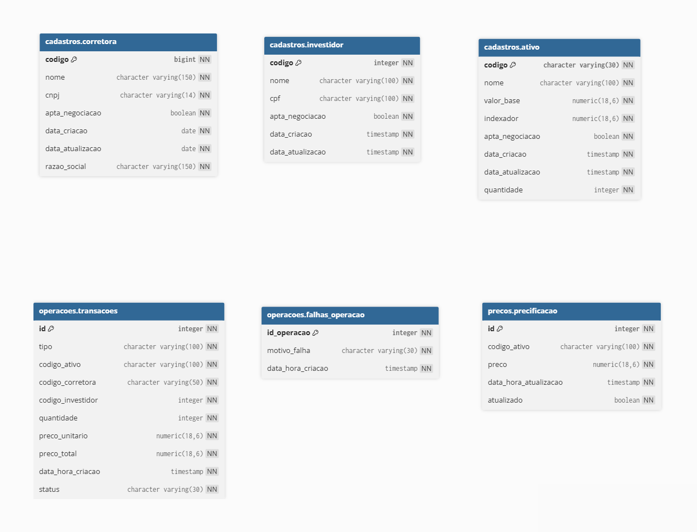

# Banco de Dados

Os banco de dados estão organizado em três domínios ou esquemas, cada um com sua própria base de dados. O domínio cadastros armazena informações de ativos, corretoras e investidores. O domínio operacoes registra as transações e falhas operacionais. O domínio precos mantém o histórico e a atualização dos preços dos ativos. Os campos data_criacao e data_atualizacao nas tabelas do domínio cadastros são gerenciados por um trigger que atualiza automaticamente data_atualizacao a cada alteração de registro.

> **Nota:** Os campos `data_criacao` e `data_atualizacao` nas tabelas do domínio `cadastros` são gerenciados por um **trigger** que atualiza automaticamente `data_atualizacao` a cada alteração de registro.

---

## CADASTRO.CORRETORA
Armazena informações das corretoras registradas no sistema.

| Coluna | Tipo | Restrição | Descrição |
|--------|------|-----------|-----------|
| `codigo` | `bigint` | `NOT NULL` | Identificador único da corretora (PK) |
| `nome` | `character varying(150)` | `NOT NULL` | Nome fantasia da corretora |
| `razao_social` | `character varying(150)` | `NOT NULL` | Razão social da corretora |
| `cnpj` | `character varying(14)` | `NOT NULL` | CNPJ da corretora (apenas números) |
| `apta_negociacao` | `boolean` | `NOT NULL` | Indica se a corretora está apta a negociar |
| `data_criacao` | `date` | `NOT NULL` | Data de criação do registro |
| `data_atualizacao` | `date` | `NOT NULL` | Data da última atualização |

---

### CADASTRO.INVESTIDOR
Armazena informações dos investidores.

| Coluna | Tipo | Restrição | Descrição |
|--------|------|-----------|-----------|
| `codigo` | `integer` | `NOT NULL` | Identificador único do investidor (PK) |
| `nome` | `character varying(100)` | `NOT NULL` | Nome completo do investidor |
| `cpf` | `character varying(100)` | `NOT NULL` | CPF do investidor (apenas números) |
| `apta_negociacao` | `boolean` | `NOT NULL` | Indica se o investidor está apto a negociar |
| `data_criacao` | `timestamp` | `NOT NULL` | Data/hora de criação do registro |
| `data_atualizacao` | `timestamp` | `NOT NULL` | Data/hora da última atualização |

---

### CADASTRO.ATIVO
Armazena os ativos financeiros disponíveis para negociação.

| Coluna | Tipo | Restrição | Descrição                                        |
|--------|------|-----------|--------------------------------------------------|
| `codigo` | `character varying(30)` | `NOT NULL` | Código único do ativo (PK)                       |
| `nome` | `character varying(100)` | `NOT NULL` | Nome do ativo                                    |
| `valor_base` | `numeric(18,6)` | `NOT NULL` | Valor base para operação do ativo                                                 |
| `indexador` | `numeric(18,6)` | `NOT NULL` | Percentual de valorização/desvalorização do ativo |
| `quantidade` | `integer` | `NOT NULL` | Quantidade total do ativo                        |
| `apta_negociacao` | `boolean` | `NOT NULL` | Indica se o ativo está disponível para negociação |
| `data_criacao` | `timestamp` | `NOT NULL` | Data/hora de criação do registro                 |
| `data_atualizacao` | `timestamp` | `NOT NULL` | Data/hora da última atualização                  |

---

### OPERACOES.TRANSACOES
Registra todas as transações realizadas.

| Coluna | Tipo | Restrição | Descrição                             |
|--------|------|-----------|---------------------------------------|
| `id` | `integer` | `NOT NULL` | Identificador único da transação (PK) |
| `tipo` | `character varying(100)` | `NOT NULL` | Tipo da operação (ex: compra, venda)  |
| `codigo_ativo` | `character varying(100)` | `NOT NULL` | Código do ativo negociado             |
| `codigo_corretora` | `character varying(50)` | `NOT NULL` | Código da corretora envolvida         |
| `codigo_investidor` | `integer` | `NOT NULL` | Código do investidor                  |
| `quantidade` | `integer` | `NOT NULL` | Quantidade de ativos negociados       |
| `preco_unitario` | `numeric(18,6)` | `NOT NULL` | Preço unitário do ativo               |
| `preco_total` | `numeric(18,6)` | `NOT NULL` | Preço total da transação              |
| `data_hora_criacao` | `timestamp` | `NOT NULL` | Data/hora da transação                |
| `status` | `character varying(30)` | `NOT NULL` | Status da operação (ex: sucesso, falha)           |

---

### OPERACOES.FALHAS_OPERACAO
Armazena informações sobre falhas ocorridas durante as operações.

| Coluna | Tipo | Restrição | Descrição |
|--------|------|-----------|-----------|
| `id_operacao` | `integer` | `NOT NULL` | ID da operação que falhou (PK/FK) |
| `motivo_falha` | `character varying(30)` | `NOT NULL` | Motivo da falha |
| `data_hora_criacao` | `timestamp` | `NOT NULL` | Data/hora do registro da falha |

---
### OPERACOES.PRECIFICACAO
Mantém os preços atualizados dos ativos.

| Coluna | Tipo | Restrição | Descrição                            |
|--------|------|-----------|--------------------------------------|
| `id` | `integer` | `NOT NULL` | Identificador único do registro (PK) |
| `codigo_ativo` | `character varying(100)` | `NOT NULL` | Código do ativo                      |
| `preco` | `numeric(18,6)` | `NOT NULL` | Preço do ativo                       |
| `data_hora_atualizacao` | `timestamp` | `NOT NULL` | Data/hora da atualização      |
| `atualizado` | `boolean` | `NOT NULL` | Indicador se o preço é o atualizado  |

---