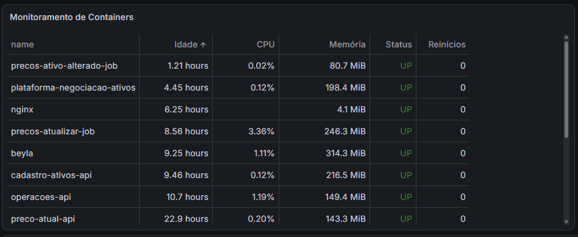
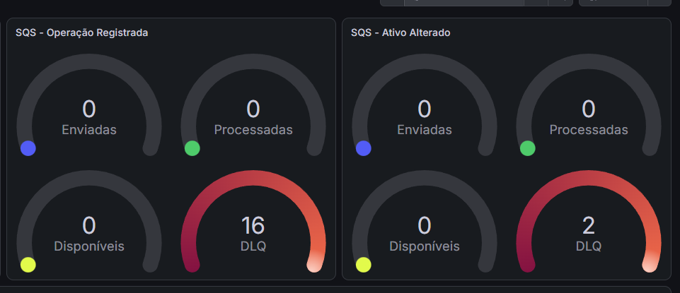
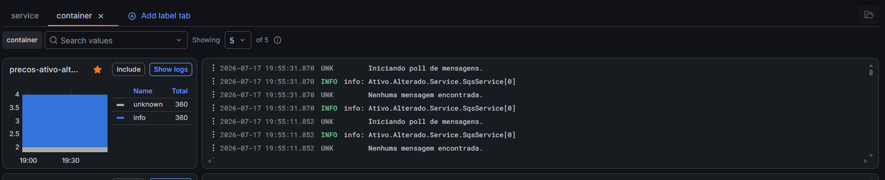

# Observabilidade e Monitoramento

## Visão Geral

Para garantir a saúde e o bom funcionamento da plataforma, adotamos o **Grafana** como ferramenta central de observabilidade. Através de dashboards personalizados, é possível monitorar em tempo real o status dos containers, o consumo de recursos e a fila de mensagens SQS, além de visualizar logs de cada microsserviço.

---

## 1. Monitoramento de Containers

O dashboard de containers exibe uma visão consolidada de todos os microsserviços em execução na EC2, permitindo identificar rapidamente containers com comportamento anômalo, como alto consumo de CPU ou memória, além de verificar se todos os serviços estão em execução.

---

## 2. Monitoramento de Filas SQS

O monitoramento contínuo das filas SQS é fundamental para garantir a confiabilidade e a performance da comunicação assíncrona entre os microsserviços. Através da análise das métricas disponíveis no Grafana, é possível:

- **Identificar gargalos:** Mensagens acumuladas na fila indicam que o consumidor está processando em uma velocidade inferior à produção, sugerindo a necessidade de escalar o consumidor ou otimizar seu processamento.

- **Detectar falhas:** Mensagens direcionadas para a Dead Letter Queue (DLQ) apontam para erros recorrentes no processamento, como problemas de integração, validação ou exceções não tratadas que requerem intervenção da equipe.

- **Analisar volume:** O acompanhamento do número de mensagens enviadas e processadas permite entender o tráfego entre os serviços, identificar picos de demanda e planejar a capacidade da infraestrutura de forma adequada.

---
## 3. Logs dos Containers

O Grafana também é utilizado para centralizar e visualizar os logs gerados por cada container. Através da interface, é possível filtrar logs por container, nível de severidade (INFO, WARN, ERROR) e período.

